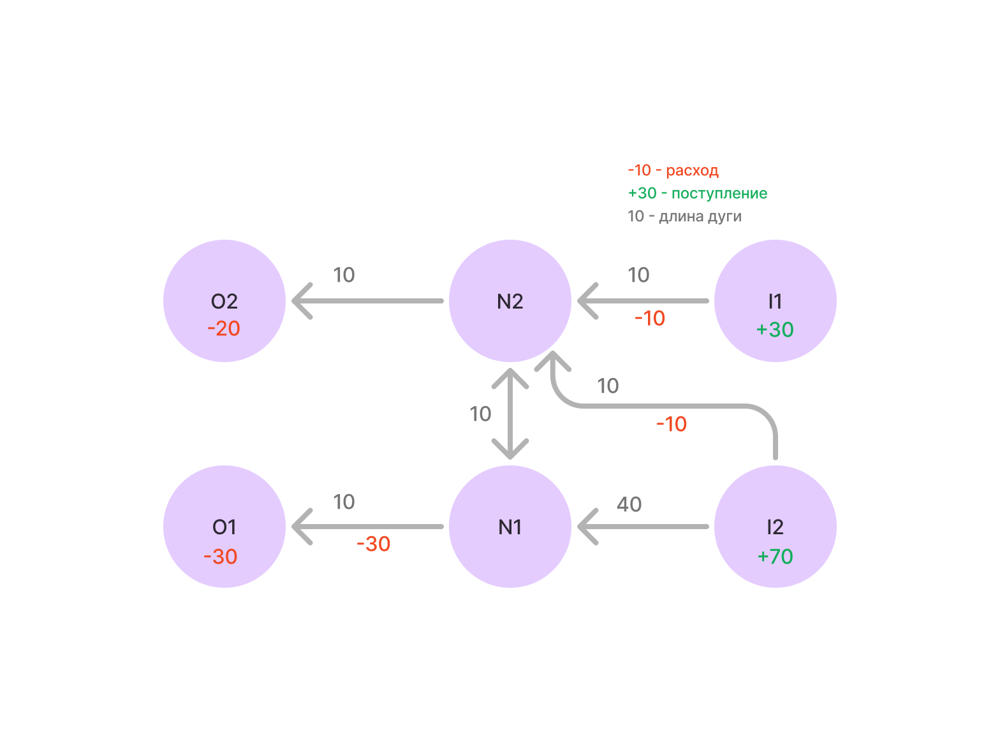

Небольшой пет проект по решению оптимизационной потоковой задачи. Накидал вечером.

Сразу отвечу на возможные вопросы:
1. Все возможные обработки ошибок, безопасность в рантайме, логирование не писал.
2. Совсем в абстракцию и универсальность уходить не стал, накидал некоторый концепт.
3. Какие-то глобальные архитектурные паттерны тут также не применял

Структура тут простая, комментарии не стал вставлять. Если возникнет желание\необходимость - могу все откоментить без проблем :)
Сорри за стремноватую картинку, на ней тестовый пример.

